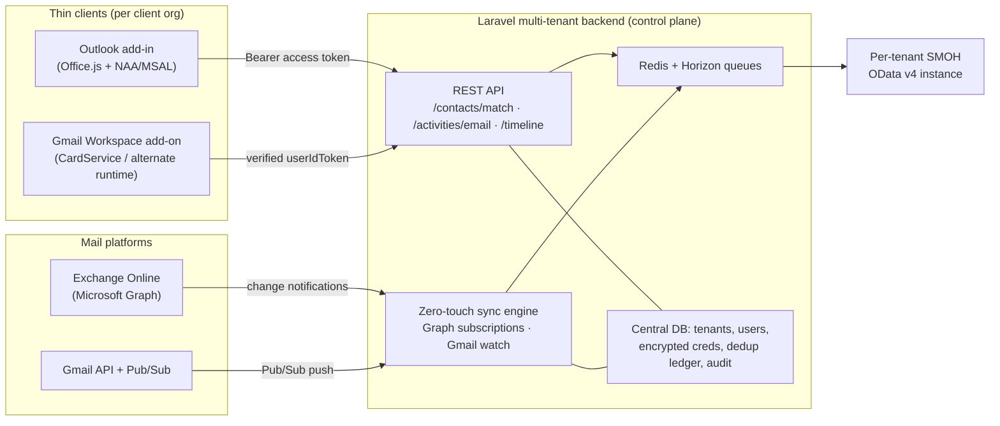

# Master Plan: Email‑to‑CRM Tracking for SMOH (Outlook + Gmail, multi‑tenant SaaS)

> **Supersedes** the single‑add‑in draft in [`outlook.md`](./outlook.md). That draft assumed one Outlook add‑in against an internal CRM. This plan reflects the real product: a **multi‑tenant SaaS** that connects each client organization's mailboxes — **Microsoft Outlook _and_ Google Gmail (both mandatory)** — to their own **SMOH CRM** instance, through **one shared Laravel backend**.
>
> Technical facts here were researched and adversarially verified against official Microsoft, Google, and Laravel documentation (July 2026). Corrections to the original draft are called out in [§9](#9-corrections-vs-the-original-outlookmd).

---

## 1. Objectives

| Goal | What it means here |
| :--- | :--- |
| **Data integrity** | Automatically link inbound/outbound client email to the correct SMOH contact and log it as a `CRM.Email` activity (via `regarding_id` + `regarding_type`). |
| **Platform parity** | Same capability whether the client's users are on Outlook/M365 or Gmail/Google Workspace. |
| **Zero client‑secret handling** | No client ever types their SMOH password into a mail UI. Identity is federated; SMOH credentials live only server‑side. |
| **Efficiency** | User‑driven one‑click logging **and** zero‑touch background sync. |
| **Security & compliance** | Handle many orgs' email content (PII) under strict tenant isolation, encryption, and the certifications each marketplace requires. |

---

## 2. Product context

- **SMOH** is a metadata‑driven **OData v4** CRM. Contacts have `id` (GUID), `email`, `email_business`, `email_personal`. Activities link to a record via the scalar pair **`regarding_id` + `regarding_type`** (e.g. a `CRM.Email` activity). Auth is a **Bearer JWT** obtained from `POST /auth/login`. The `CRM.Email` OData entity‑set name is **not hardcoded** — it is resolved at runtime from `{base}/odata/$metadata`.
- We are the **SaaS vendor**. Each **client org = one tenant**, mapped to that org's own SMOH instance + service credentials.
- **Both Outlook and Gmail are mandatory** because clients use different mail platforms.

---

## 3. Architecture

**One multi‑tenant backend (the brain) + two thin clients + a zero‑touch sync engine.** The clients only handle sign‑in, read the current message, and render UI; all matching, dedup, logging, and background sync live in the backend, which talks to each tenant's SMOH **server‑to‑server** (which also eliminates browser CORS entirely).



**Monorepo layout** (the current repo becomes `packages/addin-outlook`; its `src/crm/` seeds both `packages/core` and the backend's SMOH client):

```
packages/
  core/            shared TS: SMOH client contract, types, dedup keys
  backend/         Laravel: multi-tenant API + sync engine  ← the brain
  addin-outlook/   Office.js add-in (thin)   ← what we already built
  addin-gmail/     Google Workspace Add-on (thin)
```

---

## 4. Component A — Laravel backend (the brain)

**Stack (verified July 2026):** Laravel 13, `stancl/tenancy` ^3.10, `laravel/sanctum` ^4.3, `laravel/horizon` ^5, `firebase/php-jwt` ^7.0, Redis, Octane (FrankenPHP).

### 4.1 Multi‑tenancy
- **`stancl/tenancy` single‑database mode** (`BelongsToTenant` + `tenant_id` global scope). Per‑tenant data is small operational metadata, and the sync engine needs cross‑tenant queries ("renew all subscriptions expiring in < 2 days") in one pass. `stancl`'s `QueueTenancyBootstrapper` restores tenant context inside queued jobs.
- **Multi‑database mode** is a one‑config upgrade offered to enterprise clients with contractual isolation needs.
- A **tenant row carries** `smoh_base_url`, `smoh_auth_username` (encrypted), `smoh_auth_password` (encrypted), `smoh_email_activity_set`.

### 4.2 Client → backend auth (no passwords in the UI)
- Clients present a provider **OIDC access token** (Entra for Outlook, Google for Gmail). A `TokenVerifier` uses `firebase\JWT\CachedKeySet` (Redis‑cached JWKS) to validate `iss` / `aud` / `exp` / signature, then **exchanges it for a first‑party Laravel Sanctum token** with abilities (`activities:write`, `contacts:read`). All `/api/v1/*` are `auth:sanctum`.
- The `tid` (Entra) / `sub` (Google) claim maps **user → tenant → that tenant's SMOH instance**. The backend then calls SMOH `POST /auth/login` itself with the per‑tenant service credential. **No SMOH password ever reaches a client.**
- Sanctum (not Passport): we *consume* provider tokens; we are not an OAuth server.

### 4.3 Secret storage
Laravel **encrypted casts** (`encrypted`, `encrypted:array`, …) on **TEXT** columns for OAuth refresh tokens + SMOH creds (AES‑256 via `APP_KEY`). Graceful key rotation via `APP_PREVIOUS_KEYS`; back `APP_KEY` with a managed secrets vault.

### 4.4 SMOH client service (server‑side port of the add‑in's `src/crm/crmClient.ts`)
- `login()` caches the SMOH JWT per tenant.
- `findContactByEmail()` → `$filter=(tolower(email) eq '…' or tolower(email_business) eq '…')&$top=1`.
- `logEmailActivity()` → `POST /odata/{CRM.Email set}` with `regarding_id` + `regarding_type`; new id parsed from the **`OData-EntityId`** response header.
- On startup, resolve the `CRM.Email` set name from `/odata/$metadata` per tenant.

### 4.5 Core API (what the clients call)
| Method + path | Body → result |
| :--- | :--- |
| `POST /api/v1/auth/exchange` | `{provider, id_token}` → Sanctum token |
| `POST /api/v1/contacts/match` | `{email}` → `{contactId | null}` |
| `POST /api/v1/activities/email` | `{internetMessageId, subject, body, from, to[], sentAt, direction, syntheticKey}` → dedups on ledger, dispatches `LogEmailActivityJob` |
| `GET /api/v1/contacts/{id}/timeline` | → SMOH `$filter=regarding_id eq {id} and regarding_type eq 'CRM.Email'`, `$orderby` sent desc |

### 4.6 Async processing
Redis + **Horizon**. Jobs `ParseNotificationJob`, `MatchContactJob`, `LogEmailActivityJob` each `implements ShouldBeUnique`, `public $backoff = [10,30,60,300,600]; public $tries = 8;` and on SMOH `429` call `$this->release($retryAfter ?? 60)`. Supervisors partitioned by queue (`webhooks`, `sync`, `maintenance`).

### 4.7 Zero‑touch ingestion endpoints
- **Microsoft Graph webhook:** if `?validationToken` present → return `urldecode($token)` as `text/plain 200` within 10 s; else verify `clientState`, enqueue the notification, return **202 within 3 s**. Scheduled `graph:renew-subscriptions` PATCHes before expiry; a lifecycle controller handles `reauthorizationRequired` / `subscriptionRemoved` / `missed`.
- **Gmail Pub/Sub push:** verify the `Authorization` OIDC JWT (`aud` = this URL, `email` = configured push service account, `email_verified` = true); `base64` decode `message.data` → `{emailAddress, historyId}`; dispatch `GmailHistoryJob` → `users.history.list(startHistoryId=last)`. Scheduled `gmail:renew-watches` runs daily.

### 4.8 Suggested migrations
`tenants`, `users(tenant_id, entra_oid/google_sub, email, provider)`, `oauth_credentials(user_id, provider, access_token[enc], refresh_token[enc], expires_at)`, `graph_subscriptions(user_id, subscription_id, resource, client_state, expiration)`, `gmail_watches(user_id, topic, history_id, expiration)`, `email_activity_ledger(tenant_id, internet_message_id, synthetic_key, smoh_activity_id, UNIQUE(tenant_id, internet_message_id))`.

### 4.9 Deployment
Laravel Cloud **or** Forge + Octane (FrankenPHP). Supervisor for `octane:start` + `horizon`. Public **HTTPS** (webhooks require it). Health route `/up`. Optionally firewall the Graph webhook to Microsoft's published notification IP ranges. Audit every track attempt (tenant, message id, outcome, SMOH status).

---

## 5. Component B — Outlook add‑in (thin client)

Manifest/build basics are **already built and validated** in this repo (XML add‑in‑only manifest, webpack single‑file `commands` bundle, `OnMessageSend` Smart Alert with `SoftBlock`, Mailbox req‑set 1.15). The SaaS‑specific layer:

### 5.1 Auth — Nested App Authentication (NAA), not the legacy flow
- Use **MSAL.js `@azure/msal-browser` ^5** with `createNestablePublicClientApplication`. NAA is Microsoft's **current recommended** path; the old `getAccessToken`/OBO flow is now documented as **legacy**, and legacy Exchange identity/callback tokens are **already turned off tenant‑wide**.
- Request an **access token for your OWN custom API scope** `api://<app-id>/access_as_user` — **never the Graph, never the ID token** (passing the ID token over the network is a documented anti‑pattern). Send it as `Authorization: Bearer` to the backend, which validates the Entra JWT and reads `oid`/`tid`.
- Because the add‑in reads the body via **Office.js item APIs (not Graph)**, it needs **no Graph scopes and no tenant‑admin consent** — a rep can install and log immediately.

### 5.2 Entra app registration
**One multi‑tenant app** in the ISV tenant (`signInAudience = AzureADMultipleOrgs`), an **SPA `brk-multihub://<origin>` redirect** (origin only, no path), **Verified Publisher**. Check `isSetSupported('NestedAppAuth','1.1')` at runtime (not declarable in the XML manifest).

### 5.3 Auth inside the `OnMessageSend` handler
Interactive popups are **blocked** in the event runtime (`displayDialogAsync`, `messageParent`, `Office.context.auth.getAccessToken`). Acquire the backend token **silently** (`OfficeRuntime.auth.getAccessToken`, supported in all event‑capable builds; MSAL silent also works). If silent auth or the network call fails → **`SoftBlock`** with a message telling the user to open the task pane to sign in once (primes the MSAL cache).

### 5.4 Distribution
Publish to **Microsoft Marketplace** via Partner Center; pursue an **unrestricted listing** so `OnMessageSend` auto‑launches on direct user *or* admin install (Outlook is the only host that supports this). Requires **Microsoft 365 Certification** + the form at `aka.ms/AutoLaunchForEndUser` + a usage/market‑trend review. `SoftBlock` is Marketplace‑eligible; `Block` would force admin‑only deployment. Until certified, pilot clients admin‑deploy via **Integrated Apps**.

---

## 6. Component C — Gmail Google Workspace Add‑on (thin client)

### 6.1 Runtime — alternate runtime, not Apps Script
Google **POSTs event JSON** to HTTPS endpoints on the **Laravel backend**, which returns **CardService (Card V1) JSON**. Keeps all logic in one PHP stack (no second Apps Script codebase). You wire an HTTP Deployment in the Marketplace SDK and verify tokens yourself.

### 6.2 UI + the on‑send gap
CardService is a **fixed widget catalog — no arbitrary HTML**. It offers a **contextual (message‑open) trigger** and a **compose trigger**, but there is **NO client‑side on‑send interception** equivalent to Outlook's `OnMessageSend`. Therefore **all outbound tracking is server‑side**: detect sent mail from the Gmail history feed (messages gaining the **`SENT`** label). Use the compose trigger only for best‑effort draft injection. Product expectation: Gmail outbound tracking is **eventually consistent** (seconds of Pub/Sub latency), not synchronous.

### 6.3 Auth
Verify the add‑on's **`userIdToken`** (Google‑signed JWT) in Laravel via `google/apiclient` `verifyIdToken()` keyed to your OAuth client ID; use the stable **`sub`** claim as the user key. Verify **`systemIdToken`** to confirm the request truly came from Google (public endpoint).

### 6.4 Scopes + zero‑touch
- Background sync needs a **full offline OAuth grant** (`access_type=offline` → per‑user refresh token). The add‑on's own `gmail.addons.*` scopes only yield a short‑lived per‑message token and cannot drive `watch`.
- **Scope choice:** `gmail.metadata` (headers only) if logging From/To/Cc/Subject/Date/Message‑ID suffices; escalate to **`gmail.readonly`** only if the body is required. ⚠️ **Both are RESTRICTED scopes** — `gmail.metadata` does **not** exempt you from the security assessment.
- Sync: `users.watch(labelIds=['INBOX'])` → Pub/Sub → `historyId` + `users.history.list`. **Renew daily** (hard 7‑day cap).

### 6.5 Distribution
**Google Workspace Marketplace** requires OAuth **brand verification** + **restricted‑scope verification** + the annual, third‑party **CASA Tier 2 / AL2 security assessment** (App Defense Alliance lab). This is the **biggest cost/timeline risk** of the Gmail pillar — start it in parallel with development; a testing build is capped at ~100 users until cleared.

---

## 7. Cross‑cutting design

### 7.1 Identity → tenant → SMOH
Outlook (Entra NAA) and Gmail (Google OIDC) both send a token to the backend, which maps **(issuer + subject/tenant) → internal user → tenant → tenant's SMOH instance**, then calls SMOH `POST /auth/login` with a per‑tenant service credential from the vault. No SMOH secret is ever in a client.

### 7.2 Unified activity model + dedup
The backend writes **one canonical shape** to SMOH: `regarding_type='CRM.Email'`, `regarding_id` = matched contact, plus subject / **sanitized** body / direction / timestamp / participants.
**Dedup key = normalized RFC 5322 Message‑ID**, exposed as Graph `message.internetMessageId` (Outlook) and the `Message-Id` header in Gmail `payload.headers` — the same standards header on both providers. Enforce `UNIQUE(tenant_id, message_id)`. For **send‑time capture** (no server Message‑ID yet), use a **synthetic idempotency key** = `hash(tenant, user, sorted-recipients, subject, minute-bucket)` and reconcile to the real Message‑ID when the sent item later surfaces via sync.

### 7.3 Zero‑touch sync engine — provider comparison
| | **Microsoft Graph** | **Gmail** |
| :--- | :--- | :--- |
| Mechanism | Change‑notification **subscription** (webhook) | `users.watch` → **Cloud Pub/Sub** push |
| Permission | App permission **Mail.Read**, admin consent, scoped by **RBAC for Applications** in Exchange Online | Restricted **`gmail.readonly`** (or `gmail.metadata`), per‑user offline OAuth |
| Payload | `resourceData.id` (fetch the message) | `historyId` → `users.history.list` diff |
| **Max lifetime** | **10,080 min (~7 days)** for messages; **1,440 min (~1 day)** with resource data | **7 days** |
| Renewal | `PATCH` before expiry; handle **lifecycle** notifications | re‑call `watch` (recommend **daily**) |
| Latency | avg < 1 min, max ~3 min | seconds (Pub/Sub) |

> ⚠️ The **10,080‑minute** figure corrects both the original `outlook.md` and a stale value that appeared mid‑research. See [§9](#9-corrections-vs-the-original-outlookmd).

Both need **renewal cron jobs**, **domain‑blacklist filtering** (drop internal mail), and a **delta catch‑up reconciliation** on missed renewals / stale `historyId` (404).

### 7.4 Security & compliance / certifications
| Gate | Applies to | Notes |
| :--- | :--- | :--- |
| Entra **Verified Publisher** + **Publisher Attestation** | Outlook | Fast (~1 hr for attestation); trusted‑badge consent. Do first. |
| **Microsoft 365 Certification** | Outlook (required for unrestricted listing) | Annual independent audit; **mandatory 3rd‑party pen test** because email content goes to a non‑Microsoft backend; TLS 1.2+ (1.3 rec.); GDPR notice w/ SAR/erasure/retention; least privilege. |
| **Google CASA Tier 2 / AL2** + OAuth verification | Gmail | Annual, required by the restricted Gmail scope; ~weeks lead time. |
| **SOC 2 Type II** (not strictly store‑mandated) | Both | Expected by enterprise clients; satisfies most M365 Certification controls. Pursue in parallel. |
Cross‑tenant safeguards: strict `tenant_id` scoping on every query, per‑tenant credential isolation, encryption at rest + TLS in transit, body sanitization + data minimization (store only matched‑contact mail), append‑only audit log.

---

## 8. Phased roadmap

1. **Phase 1 — User‑driven MVP.** Laravel backend (tenancy, `auth/exchange`, `contacts/match`, `activities/email`, SMOH client, dedup ledger). Outlook add‑in (NAA) + Gmail add‑on (contextual card) both calling the backend. Runs within Gmail's 100‑test‑user cap and Outlook Integrated‑Apps deploy. **Deliverable: one‑click "Log to CRM" on both platforms.**
2. **Phase 2 — Zero‑touch sync.** Graph subscriptions (app permission + RBAC) and Gmail `watch`/Pub/Sub, renewal crons, lifecycle handling, blacklist filtering, reconciliation. **Deliverable: automatic background tracking.**
3. **Phase 3 — Marketplace certification & scale.** Entra Verified Publisher → M365 Certification + Outlook unrestricted listing; Google brand + restricted‑scope verification + CASA Tier 2; SOC 2 Type II. **Deliverable: public listings with auto‑launch.**

---

## 9. Corrections vs. the original `outlook.md`

| Original said | Corrected (verified) |
| :--- | :--- |
| Graph subscription renew every **4230 min (3 days)** | **10,080 min (~7 days)** for Outlook message subscriptions (1,440 min with resource data). 4230 min now applies to *other* resources (callRecord, onlineMeeting, …). Renew **daily**, well before expiry. |
| "Phase 2: Core **Core** Engine" | typo. |
| Dedup by hashing **`InternetMessageId`** | Correct for **read/inbound** mail, but `internetMessageId` is **empty during `OnMessageSend`** (compose) — use the **synthetic key** at send time and reconcile later. |
| Manifest `manifest.json` **or** `manifest.xml`, generic | Use the **XML add‑in‑only manifest** (unified JSON drops Outlook‑Mac/mobile). |
| Add‑in auth via OAuth2/OIDC delegated (unspecified) | **NAA + MSAL v5**, custom‑API access token (never ID token); legacy `getAccessToken`/Exchange tokens are deprecated/off. |
| "Backend Option B" as an alternative path | Not an alternative — the **shared backend is the center** of the SaaS, and Gmail *forces* server‑side outbound capture regardless. |

---

## 10. Open decisions (need product/business input)

- **Mailboxes:** org‑managed (Workspace / M365) only, or also consumer `@gmail.com` / Outlook.com? Decides Gmail domain‑wide delegation vs per‑user OAuth, and NAA coverage.
- **Body logging:** does the MVP need email **bodies** (→ restricted `gmail.readonly` + heavier CASA) or do **headers/metadata** suffice initially?
- **SMOH per‑tenant credential:** a dedicated integration service account per client for `POST /auth/login`, or per‑user delegated identity? How are these rotated? Confirm the exact `CRM.Email` entity‑set name and that `regarding_type` expects `'CRM.Email'`.
- **SMOH throttling:** does it return `429` + `Retry-After`? Tune backoff accordingly.
- **Data residency & retention:** must stored email content be region‑partitioned? Should bodies be **stored** at all, or forwarded to SMOH and discarded (GDPR erasure)?
- **Launch sequencing:** which marketplace first (Microsoft vs Google) to sequence certification spend? Is SOC 2 Type II already in progress?
- **CORS/onboarding:** self‑serve tenant onboarding (admin UI for SMOH URL/creds) vs operator‑provisioned; any client requiring physical DB isolation (multi‑database mode)?

---

## 11. References (verified July 2026)

**Laravel:** [Sanctum](https://laravel.com/docs/13.x/sanctum) · [Horizon](https://laravel.com/docs/13.x/horizon) · [Queues](https://laravel.com/docs/13.x/queues) · [Encryption](https://laravel.com/docs/13.x/encryption) · [Encrypted casts](https://laravel.com/docs/12.x/eloquent-mutators) · [Octane](https://laravel.com/docs/13.x/octane) · [tenancyforlaravel v3](https://tenancyforlaravel.com/docs/v3/) · [stancl/tenancy (Packagist)](https://packagist.org/packages/stancl/tenancy) · [firebase/php-jwt](https://github.com/firebase/php-jwt)

**Microsoft (Outlook / Entra / Graph):** [NAA in your add-in](https://learn.microsoft.com/en-us/office/dev/add-ins/develop/enable-nested-app-authentication-in-your-add-in) · [NAA legacy-tokens FAQ](https://learn.microsoft.com/en-us/office/dev/add-ins/outlook/faq-nested-app-auth-outlook-legacy-tokens) · [Outlook-Add-in-SSO-NAA-Identity sample](https://github.com/OfficeDev/Office-Add-in-samples/tree/main/Samples/auth/Outlook-Add-in-SSO-NAA-Identity) · [Event-based activation](https://learn.microsoft.com/en-us/office/dev/add-ins/develop/event-based-activation) · [SSO in event-based activation](https://learn.microsoft.com/en-us/office/dev/add-ins/develop/use-sso-in-event-based-activation) · [OnMessageSend / Smart Alerts](https://learn.microsoft.com/en-us/office/dev/add-ins/outlook/onmessagesend-onappointmentsend-events) · [Auto-launch store options](https://learn.microsoft.com/en-us/office/dev/add-ins/publish/autolaunch-store-options) · [Multi-tenant app](https://learn.microsoft.com/en-us/entra/identity-platform/howto-convert-app-to-be-multi-tenant) · [Publisher verification](https://learn.microsoft.com/en-us/entra/identity-platform/publisher-verification-overview) · [M365 Certification](https://learn.microsoft.com/en-us/microsoft-365-app-certification/docs/certification) · [Graph subscription resource (max-expiration table)](https://learn.microsoft.com/en-us/graph/api/resources/subscription) · [Change notifications (webhooks)](https://learn.microsoft.com/en-us/graph/change-notifications-delivery-webhooks) · [Lifecycle events](https://learn.microsoft.com/en-us/graph/change-notifications-lifecycle-events) · [RBAC for Applications (EXO)](https://learn.microsoft.com/en-us/exchange/permissions-exo/application-rbac) · [Approved-client-app CA retirement](https://learn.microsoft.com/en-us/entra/identity/conditional-access/migrate-approved-client-app)

**Google (Gmail / Workspace / OAuth):** [Alternate runtimes](https://developers.google.com/workspace/add-ons/guides/alternate-runtimes) · [Connect a third-party service](https://developers.google.com/workspace/add-ons/guides/connect-third-party-service) · [Gmail push (watch + Pub/Sub)](https://developers.google.com/workspace/gmail/api/guides/push) · [users.watch](https://developers.google.com/workspace/gmail/api/reference/rest/v1/users/watch) · [Gmail scopes](https://developers.google.com/workspace/gmail/api/auth/scopes) · [Verify Google ID token](https://developers.google.com/identity/gsi/web/guides/verify-google-id-token) · [Authenticate Pub/Sub push](https://docs.cloud.google.com/pubsub/docs/authenticate-push-subscriptions) · [Restricted-scope verification](https://developers.google.com/identity/protocols/oauth2/production-readiness/restricted-scope-verification) · [Marketplace publishing](https://developers.google.com/workspace/marketplace/how-to-publish)
